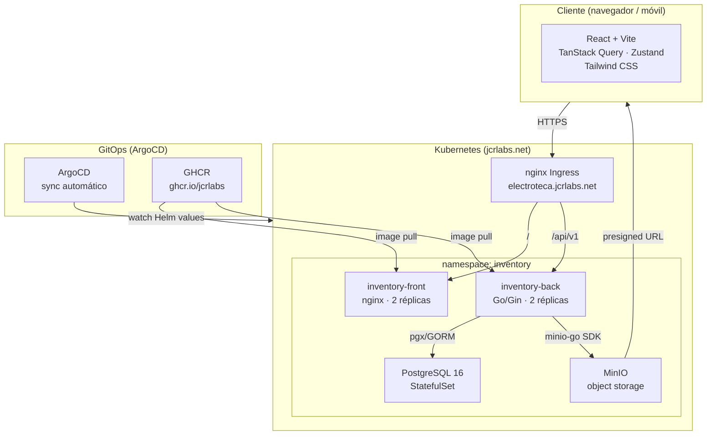
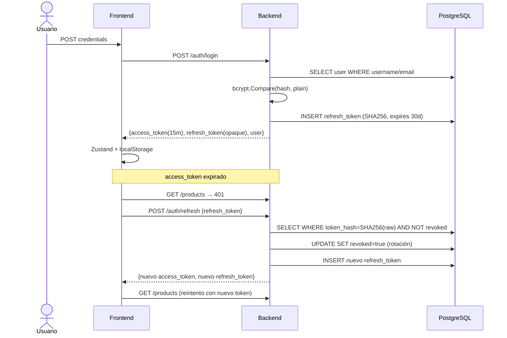

# Electroteca — Arquitectura Global

Visión completa del sistema: frontend, backend, almacenamiento, autenticación, despliegue y comunicaciones.

---

## 1. Vista de alto nivel



---

## 2. Frontend

### Stack
| Capa | Tecnología |
|---|---|
| Framework | React 18 + TypeScript |
| Build | Vite |
| Estilos | Tailwind CSS (tema dark personalizado — zinc/ámbar) |
| Estado servidor | TanStack Query v5 |
| Estado cliente | Zustand (auth store) |
| Formularios | React Hook Form |
| Routing | React Router v6 |
| HTTP | axios (cliente configurado con interceptors) |
| Notificaciones | react-hot-toast |

### Estructura de carpetas
```
src/
├── api/           # Clientes HTTP por dominio (auth, products, categories…)
├── components/
│   ├── common/    # Modal, Pagination, Skeleton, Badge, ConfirmDialog
│   ├── layout/    # Layout, Sidebar (sidebar + mobile header)
│   └── products/  # ProductCard, ProductForm, ImageUpload
├── hooks/         # useDebounce, usePermissions
├── pages/         # Una página por ruta (Dashboard, Products, Categories…)
├── store/         # authStore (Zustand + localStorage)
└── types/         # Tipos TypeScript compartidos
```

### Flujo de datos
```
Usuario
  └─▶ Page component
        ├─▶ useQuery(queryKey, queryFn)   ← TanStack Query cachea y refetch
        │     └─▶ api/*.ts               ← axios → /api/v1/...
        │           └─▶ Backend REST
        └─▶ useMutation(mutationFn)
              └─▶ onSuccess → invalidateQueries → refresco automático
```

### Autenticación en el cliente
```
Login
  └─▶ authApi.login() → {access_token, refresh_token, expires_at, user}
        └─▶ authStore.setAuth() → localStorage

Cada request HTTP (axios interceptor):
  1. Adjunta Authorization: Bearer <access_token>
  2. Si 401 → POST /auth/refresh con refresh_token
  3. Nuevo access_token → reintentar request original
  4. Si refresh también falla → authStore.logout() → /login
```

### RBAC en el cliente (usePermissions hook)
| Rol | Puede ver | Puede crear/editar | Puede eliminar |
|---|---|---|---|
| `viewer` | Todo | No | No |
| `manager` | Todo | Sí (propios) | Solo los propios |
| `admin` | Todo | Sí | Todo |

---

## 3. Backend

### Stack
| Capa | Tecnología |
|---|---|
| Lenguaje | Go 1.22 |
| HTTP Router | Gin |
| ORM / DB | GORM + pgx driver |
| Base de datos | PostgreSQL 16 |
| Object storage | MinIO (minio-go SDK v7) |
| Auth | JWT (RS256/HS256) + refresh tokens opacos |
| Contraseñas | bcrypt (cost 12) |

### Estructura de paquetes
```
cmd/server/          # Punto de entrada, wiring
internal/
├── handlers/        # AuthHandler, ProductHandler, CategoryHandler,
│                    # UserHandler, ContactHandler, StatsHandler, HealthHandler
├── middleware/      # JWT auth, RBAC (RequireRole, RequireManager)
├── models/          # Entidades GORM (User, Product, Category, Contact,
│                    # ProductImage, RefreshToken)
├── repository/      # Interfaces + implementaciones (userRepo, productRepo…)
└── services/        # AuthService, MinIOService
```

### API REST — Endpoints principales
```
POST   /api/v1/auth/login           → {access_token, refresh_token, user}
POST   /api/v1/auth/register        → {access_token, refresh_token, user}
POST   /api/v1/auth/refresh         → {access_token, refresh_token}
POST   /api/v1/auth/logout          → revoca refresh token
POST   /api/v1/auth/logout-all      → revoca todos los refresh tokens del usuario
GET    /api/v1/auth/me              → User
PATCH  /api/v1/auth/me              → actualiza perfil propio

GET    /api/v1/products             → PaginatedResponse<Product>
POST   /api/v1/products             → Product                [manager+]
GET    /api/v1/products/:id         → Product
PUT    /api/v1/products/:id         → Product                [manager+]
DELETE /api/v1/products/:id         → 204                    [admin | propietario]
POST   /api/v1/products/:id/images  → ProductImage           [manager+]
DELETE /api/v1/products/:id/images/:imageId → 204            [manager+]
GET    /api/v1/products/:id/contact → Contact
PUT    /api/v1/products/:id/contact → Contact                [manager+]
DELETE /api/v1/products/:id/contact → 204                    [manager+]

GET    /api/v1/categories           → ListResponse<Category>
POST   /api/v1/categories           → Category               [manager+]
PUT    /api/v1/categories/:id       → Category               [manager+]
DELETE /api/v1/categories/:id       → 204                    [manager+]

GET    /api/v1/users                → ListResponse<User>      [admin]
POST   /api/v1/users                → User                    [admin]
PUT    /api/v1/users/:id            → User                    [admin]
DELETE /api/v1/users/:id            → 204                     [admin]

GET    /api/v1/stats                → InventoryStats
GET    /health                      → {status, db, minio}
GET    /healthz/live                → 200 OK
```

### Patrón de capas en el back
```
Request HTTP
  └─▶ Gin Router
        └─▶ Middleware (JWT verify → ctx.Set("user", claims))
              └─▶ Handler (parse request, validate, llamar servicio/repo)
                    ├─▶ Repository (GORM queries → PostgreSQL)
                    └─▶ Service (AuthService / MinIOService)
                          └─▶ Response JSON
```

### Seguridad implementada
- Rate limiting: ThrottlerMiddleware por IP (login/register estricto)
- JWT access tokens de vida corta + refresh tokens opacos con rotación
- Refresh tokens almacenados como SHA-256 hash (nunca en texto plano)
- bcrypt cost 12 en todas las contraseñas
- Soft delete en todas las entidades (campo `deleted_at`)
- Queries parametrizadas siempre (`$1, $2…` en raw SQL, `?` en GORM)
- Validación de MIME type en uploads de imagen (jpg/png/webp únicamente)

---

## 4. PostgreSQL

### Modelo de datos simplificado
```
users ──────────────────────────────────────────┐
  id, username(UK), email(UK), password_hash,   │
  role, active, last_login                       │
  └─▶ refresh_tokens (user_id FK)               │
  └─▶ products (created_by_id FK) ──────────────┘
        id, name, repair_description,
        entry_date, exit_date, price, sku(UK),
        paid, status, image_key,
        category_id FK (nullable)
        └─▶ contacts (product_id UK) — 1:1
        └─▶ product_images (product_id) — 1:N

categories
  id, name(UK), description
```

Todas las tablas tienen `deleted_at` para soft delete vía GORM.  
Los índices críticos: `products(status)`, `products(paid)`, `products(created_by_id)`, `refresh_tokens(token_hash)`.

---

## 5. MinIO (object storage)

```
Cliente
  └─▶ POST /api/v1/products/:id/images  (multipart form)
        └─▶ Backend valida MIME + tamaño (≤ 10MB)
              └─▶ MinIOService.UploadProductImage()
                    └─▶ PutObject("products/{uuid}.{ext}")
                          └─▶ MinIO bucket: "inventory"

Para servir imágenes al cliente:
  Backend genera URL pública (o presigned URL si bucket es privado)
  → Frontend muestra 

Para eliminar:
  DELETE /images/:imageId
    └─▶ MinIOService.DeleteObject(image_key)
    └─▶ DELETE product_images WHERE id = imageId
```

---

## 6. Autenticación — Flujo completo



---

## 7. Despliegue — GitOps con ArgoCD

```
Desarrollador
  └─▶ git push (main) / git push tag v*
        └─▶ GitHub Actions CI (test, lint, build)
              └─▶ GitHub Actions CD
                    ├─▶ docker build → ghcr.io/jcrlabs/inventory-{front|back}:vX.Y.Z
                    └─▶ git commit: sed values-prod.yaml tag → vX.Y.Z

ArgoCD (polling cada 3min o webhook)
  └─▶ detecta cambio en values-prod.yaml
        └─▶ helm upgrade inventory-{front|back}
              └─▶ Kubernetes rolling update (2 réplicas, maxUnavailable=1)
```

### Helm values-prod.yaml (fuente de verdad)
```yaml
image:
  repository: ghcr.io/jcrlabs/inventory-front  # o back
  tag: v0.1.5                                   # actualizado por CD
replicaCount: 2
```

### Triggers de CD
| Repo | Trigger | Versión |
|---|---|---|
| `inventory-front` | `git tag v*` → push tag | `VERSION` file + tag |
| `inventory-back` | `git push main` | `VERSION` file |

---

## 8. Comunicación entre servicios

```
electroteca.jcrlabs.net
  │
  └─▶ nginx Ingress (TLS terminación)
        ├─▶ path: /          → inventory-front-service:80  (nginx sirve SPA)
        └─▶ path: /api/v1    → inventory-back-service:8080 (Go/Gin)

inventory-back → postgres:5432      (GORM/pgx, pool de conexiones)
inventory-back → minio:9000         (minio-go SDK, S3-compatible API)

Frontend (SPA) → /api/v1/*          (mismo origen, sin CORS en prod)
Frontend → MinIO presigned URLs     (acceso directo a imágenes, bypass backend)
```

---

## 9. Decisiones de diseño clave

| Decisión | Razón |
|---|---|
| Bottom-sheet modal en móvil | UX nativa en touch; `items-end` en modal, `min-h-0` en scrollable para evitar overflow en iOS |
| TanStack Query en front | Cache automático, invalidación por queryKey, estado de loading/error sin boilerplate |
| Zustand para auth | Mínimo boilerplate; persistencia en localStorage con rehidratación automática |
| Refresh token con rotación | Cada uso del refresh genera uno nuevo; el anterior queda revocado → mitiga token theft |
| GORM soft delete | Trazabilidad; los registros borrados no aparecen en queries normales pero están auditables |
| MinIO separado de la DB | Las imágenes no saturan PostgreSQL; escalable independientemente |
| ArgoCD GitOps | El repositorio git es la única fuente de verdad del estado del clúster; no hay kubectl manual en prod |
| Helm + values-prod.yaml | El CD solo actualiza el tag de imagen; la configuración completa vive en el chart |
