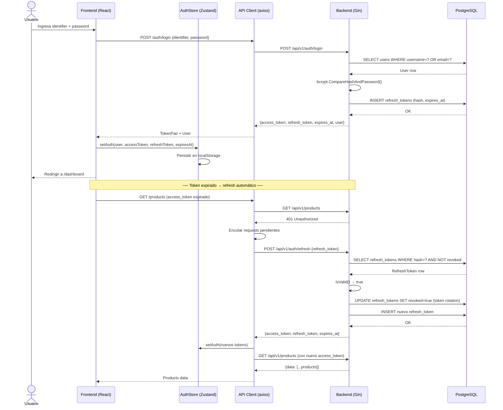
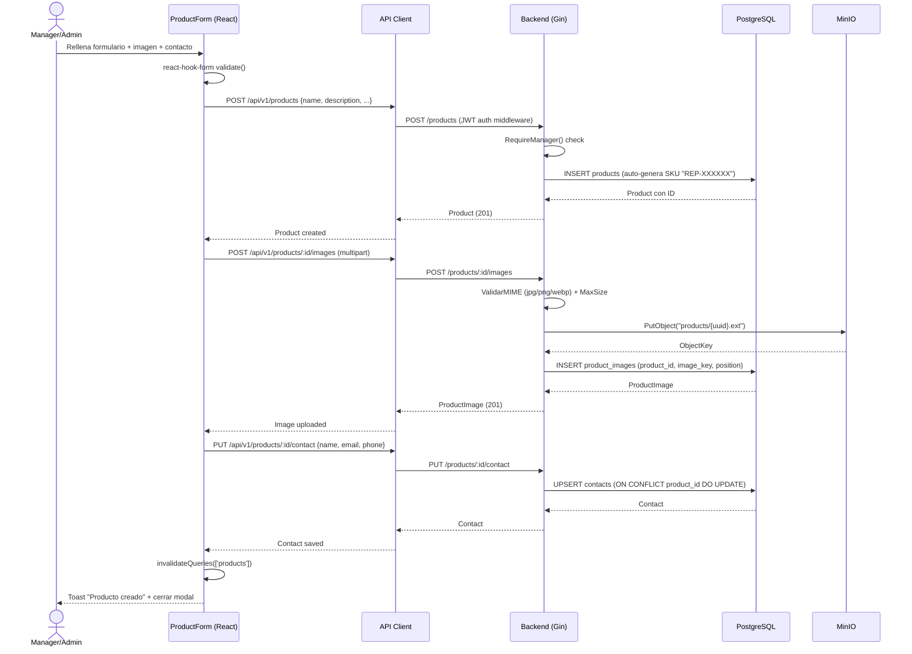
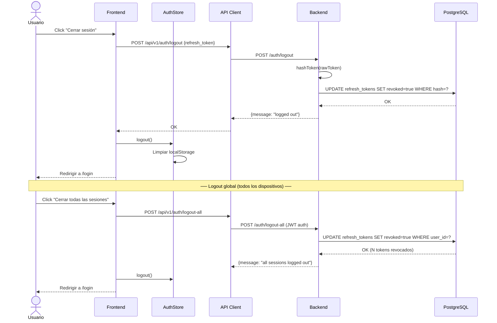
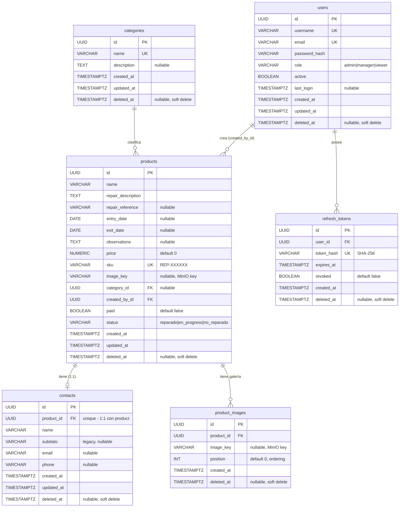

# Electroteca — Diagramas Técnicos

> Documentación unificada (backend Go + frontend React). Todos los diagramas usan sintaxis Mermaid.

---

## 1. Diagrama de Clases

```mermaid
classDiagram
    %% ─── BACKEND: DOMAIN MODELS ───────────────────────────────────────────

    class User {
        +UUID ID
        +string Username
        +string Email
        +string PasswordHash
        +Role Role
        +bool Active
        +*time.Time LastLogin
        +time.Time CreatedAt
        +time.Time UpdatedAt
        +gorm.DeletedAt DeletedAt
        --
        +CanManage() bool
        +IsAdmin() bool
        +BeforeCreate()
    }

    class Product {
        +UUID ID
        +string Name
        +string RepairDescription
        +string RepairReference
        +*DateOnly EntryDate
        +*DateOnly ExitDate
        +string Observations
        +float64 Price
        +string SKU
        +string ImageURL
        +string ImageKey
        +*UUID CategoryID
        +UUID CreatedByID
        +bool Paid
        +ProductStatus Status
        +time.Time CreatedAt
        +time.Time UpdatedAt
        +gorm.DeletedAt DeletedAt
        --
        +BeforeCreate()
    }

    class Category {
        +UUID ID
        +string Name
        +string Description
        +time.Time CreatedAt
        +time.Time UpdatedAt
        +gorm.DeletedAt DeletedAt
        --
        +BeforeCreate()
    }

    class Contact {
        +UUID ID
        +UUID ProductID
        +string Name
        +string Subdato
        +string Email
        +string Phone
        +time.Time CreatedAt
        +time.Time UpdatedAt
        +gorm.DeletedAt DeletedAt
        --
        +BeforeCreate()
    }

    class ProductImage {
        +UUID ID
        +UUID ProductID
        +string ImageURL
        +string ImageKey
        +int Position
        +time.Time CreatedAt
        +gorm.DeletedAt DeletedAt
        --
        +BeforeCreate()
    }

    class RefreshToken {
        +UUID ID
        +UUID UserID
        +string TokenHash
        +time.Time ExpiresAt
        +bool Revoked
        +time.Time CreatedAt
        +gorm.DeletedAt DeletedAt
        --
        +BeforeCreate()
        +IsValid() bool
    }

    class TokenPair {
        +string AccessToken
        +string RefreshToken
        +time.Time ExpiresAt
    }

    class Claims {
        +UUID UserID
        +string Username
        +Role Role
        +RegisteredClaims embedded
    }

    %% ─── BACKEND: SERVICES ─────────────────────────────────────────────────

    class AuthService {
        -userRepository userRepo
        -tokenRepository tokenRepo
        -[]byte jwtSecret
        -time.Duration accessTTL
        -time.Duration refreshTTL
        --
        +Login(identifier, password) TokenPair User error
        +Register(username, email, password) TokenPair User error
        +Refresh(rawToken) TokenPair User error
        +Logout(rawToken) error
        +LogoutAll(userID) error
        +ValidateAccessToken(tokenString) Claims error
        +CheckPassword(hash, plain) bool
        +HashPassword(password) string error
        -issueTokenPair(user) TokenPair error
        -generateOpaqueToken() string error
        -hashToken(raw) string
        -validatePassword(password) error
    }

    class MinIOService {
        -minio.Client client
        -string bucket
        -int64 maxBytes
        -url.URL publicURL
        --
        +Ping() bool
        +UploadProductImage(file, header) string error
        +GetPresignedURL(objectKey, expiry) string error
        +DeleteObject(objectKey)
        -ensureBucket() error
        -sniffMIME(data) string
    }

    %% ─── BACKEND: HANDLERS ─────────────────────────────────────────────────

    class AuthHandler {
        -AuthService authSvc
        -userRepository userRepo
        --
        +Login(c)
        +Register(c)
        +Refresh(c)
        +Logout(c)
        +LogoutAll(c)
        +Me(c)
        +UpdateMe(c)
    }

    class ProductHandler {
        -productRepository productRepo
        -categoryRepository categoryRepo
        -MinIOService minioSvc
        --
        +List(c)
        +Get(c)
        +Create(c)
        +Update(c)
        +Delete(c)
        +UploadImage(c)
        +AddImage(c)
        +DeleteImage(c)
        -enrichImageURLs(products)
        -parseDateField(raw) DateOnly error
    }

    class CategoryHandler {
        -categoryRepository categoryRepo
        --
        +List(c)
        +Get(c)
        +Create(c)
        +Update(c)
        +Delete(c)
    }

    class UserHandler {
        -userRepository userRepo
        -AuthService authSvc
        --
        +List(c)
        +Get(c)
        +Create(c)
        +Update(c)
        +Delete(c)
    }

    class ContactHandler {
        -contactRepository contactRepo
        -productRepository productRepo
        --
        +Get(c)
        +Upsert(c)
        +Delete(c)
    }

    class StatsHandler {
        -db gorm.DB
        --
        +GetStats(c)
    }

    class HealthHandler {
        -db gorm.DB
        -minioCheck func bool
        --
        +Health(c)
        +Live(c)
    }

    %% ─── FRONTEND: STORES ───────────────────────────────────────────────────

    class AuthStore {
        +User user
        +string accessToken
        +string refreshToken
        +Date expiresAt
        +bool isAuthenticated
        --
        +setAuth(user, accessToken, refreshToken, expiresAt)
        +updateUser(user)
        +logout()
    }

    %% ─── FRONTEND: API CLIENTS ──────────────────────────────────────────────

    class AuthApi {
        +login(identifier, password) TokenPair
        +register(data) TokenPair
        +refresh(refreshToken) TokenPair
        +logout(refreshToken?)
        +me() User
        +updateMe(data) User
    }

    class ProductsApi {
        +list(filters?) PaginatedResponse~Product~
        +get(id) Product
        +create(data) Product
        +update(id, data) Product
        +delete(id)
        +uploadImage(id, file) ImageUrl
        +addImage(id, file) ProductImage
        +deleteImage(productId, imageId)
    }

    class CategoriesApi {
        +list() ListResponse~Category~
        +get(id) Category
        +create(data) Category
        +update(id, data) Category
        +delete(id)
    }

    class UsersApi {
        +list() ListResponse~User~
        +get(id) User
        +create(data) User
        +update(id, data) User
        +delete(id)
    }

    class ContactsApi {
        +get(productId) Contact
        +upsert(productId, data) Contact
        +delete(productId)
    }

    class StatsApi {
        +get() InventoryStats
    }

    %% ─── FRONTEND: HOOKS ────────────────────────────────────────────────────

    class UsePermissions {
        +bool isAdmin
        +bool isManager
        +bool isViewer
        +bool canManage
        +canDeleteProduct(product) bool
    }

    class UseDebounce {
        +debounce(value, delay) debouncedValue
    }

    %% ─── FRONTEND: PAGES ────────────────────────────────────────────────────

    class LoginPage {
        -string identifier
        -string password
        --
        +handleSubmit()
        +render()
    }

    class RegisterPage {
        -string username
        -string email
        -string password
        --
        +handleSubmit()
        +render()
    }

    class DashboardPage {
        --
        +render()
    }

    class ProductsPage {
        -ProductFilters filters
        -string viewMode
        -int page
        --
        +handleSearch()
        +handleFilterChange()
        +handleCreate()
        +handleEdit()
        +handleDelete()
        +render()
    }

    class ProductDetailPage {
        -string productId
        --
        +handleEdit()
        +handleDelete()
        +handleImageUpload()
        +render()
    }

    class CategoriesPage {
        --
        +handleCreate()
        +handleEdit()
        +handleDelete()
        +render()
    }

    class UsersPage {
        --
        +handleCreate()
        +handleEdit()
        +handleDelete()
        +render()
    }

    %% ─── ENUMS ──────────────────────────────────────────────────────────────

    class Role {
        <<enumeration>>
        admin
        manager
        viewer
    }

    class ProductStatus {
        <<enumeration>>
        reparado
        en_progreso
        no_reparado
    }

    %% ─── RELACIONES BACKEND ─────────────────────────────────────────────────

    User "1" --> "0..*" Product : creates
    User "1" --> "0..*" RefreshToken : has
    Product "1" --> "0..1" Contact : has
    Product "1" --> "0..*" ProductImage : has gallery
    Product "0..*" --> "0..1" Category : belongs to
    User --> Role : has
    Product --> ProductStatus : has

    AuthService --> TokenPair : produces
    AuthService --> Claims : validates
    AuthHandler --> AuthService : uses
    ProductHandler --> MinIOService : uses
    AuthHandler ..> User : returns
    ProductHandler ..> Product : returns
    CategoryHandler ..> Category : returns
    UserHandler ..> User : returns
    ContactHandler ..> Contact : returns

    %% ─── RELACIONES FRONTEND ─────────────────────────────────────────────────

    LoginPage --> AuthStore : updates
    RegisterPage --> AuthStore : updates
    LoginPage --> AuthApi : calls
    RegisterPage --> AuthApi : calls
    ProductsPage --> ProductsApi : calls
    ProductsPage --> CategoriesApi : calls
    ProductDetailPage --> ProductsApi : calls
    ProductDetailPage --> ContactsApi : calls
    CategoriesPage --> CategoriesApi : calls
    UsersPage --> UsersApi : calls
    DashboardPage --> StatsApi : calls

    ProductsPage --> UsePermissions : uses
    ProductDetailPage --> UsePermissions : uses
    CategoriesPage --> UsePermissions : uses
    UsersPage --> UsePermissions : uses

    AuthStore --> AuthApi : refreshes token via
```

---

## 2. Casos de Uso

```mermaid
graph TD
    subgraph Actores
        V[Viewer]
        M[Manager]
        A[Admin]
    end

    subgraph Sistema de Inventario
        subgraph Auth
            UC1[Iniciar sesión]
            UC2[Registrarse]
            UC3[Refrescar token]
            UC4[Cerrar sesión]
            UC5[Ver perfil propio]
            UC6[Editar perfil propio]
        end

        subgraph Productos
            UC7[Ver listado de productos]
            UC8[Buscar y filtrar productos]
            UC9[Ver detalle de producto]
            UC10[Crear producto]
            UC11[Editar producto]
            UC12[Eliminar producto]
            UC13[Subir imagen principal]
            UC14[Gestionar galería de imágenes]
        end

        subgraph Contactos
            UC15[Ver contacto del producto]
            UC16[Crear/editar contacto]
            UC17[Eliminar contacto]
        end

        subgraph Categorías
            UC18[Ver categorías]
            UC19[Crear categoría]
            UC20[Editar categoría]
            UC21[Eliminar categoría]
        end

        subgraph Usuarios
            UC22[Ver lista de usuarios]
            UC23[Crear usuario]
            UC24[Editar usuario]
            UC25[Eliminar usuario]
        end

        subgraph Dashboard
            UC26[Ver estadísticas generales]
            UC27[Ver productos recientes]
        end
    end

    %% Viewer
    V --> UC1
    V --> UC2
    V --> UC3
    V --> UC4
    V --> UC5
    V --> UC6
    V --> UC7
    V --> UC8
    V --> UC9
    V --> UC15
    V --> UC18
    V --> UC26
    V --> UC27

    %% Manager (hereda Viewer)
    M --> UC1
    M --> UC2
    M --> UC4
    M --> UC5
    M --> UC6
    M --> UC7
    M --> UC8
    M --> UC9
    M --> UC10
    M --> UC11
    M --> UC12
    M --> UC13
    M --> UC14
    M --> UC15
    M --> UC16
    M --> UC17
    M --> UC18
    M --> UC19
    M --> UC20
    M --> UC26
    M --> UC27

    %% Admin (hereda Manager)
    A --> UC10
    A --> UC11
    A --> UC12
    A --> UC13
    A --> UC14
    A --> UC15
    A --> UC16
    A --> UC17
    A --> UC18
    A --> UC19
    A --> UC20
    A --> UC21
    A --> UC22
    A --> UC23
    A --> UC24
    A --> UC25
    A --> UC26
    A --> UC27
```

---

## 3. Diagrama de Secuencia

### 3.1 — Login con refresh token automático

### 3.2 — Crear producto con imagen y contacto

### 3.3 — Logout y cierre de sesión global

---

## 4. Diagrama Entidad-Relación (ER)

