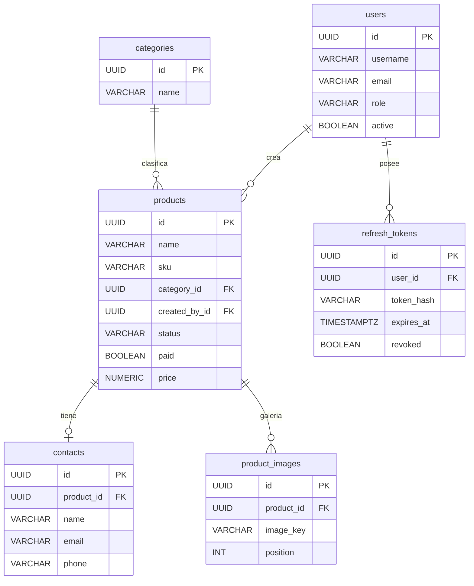
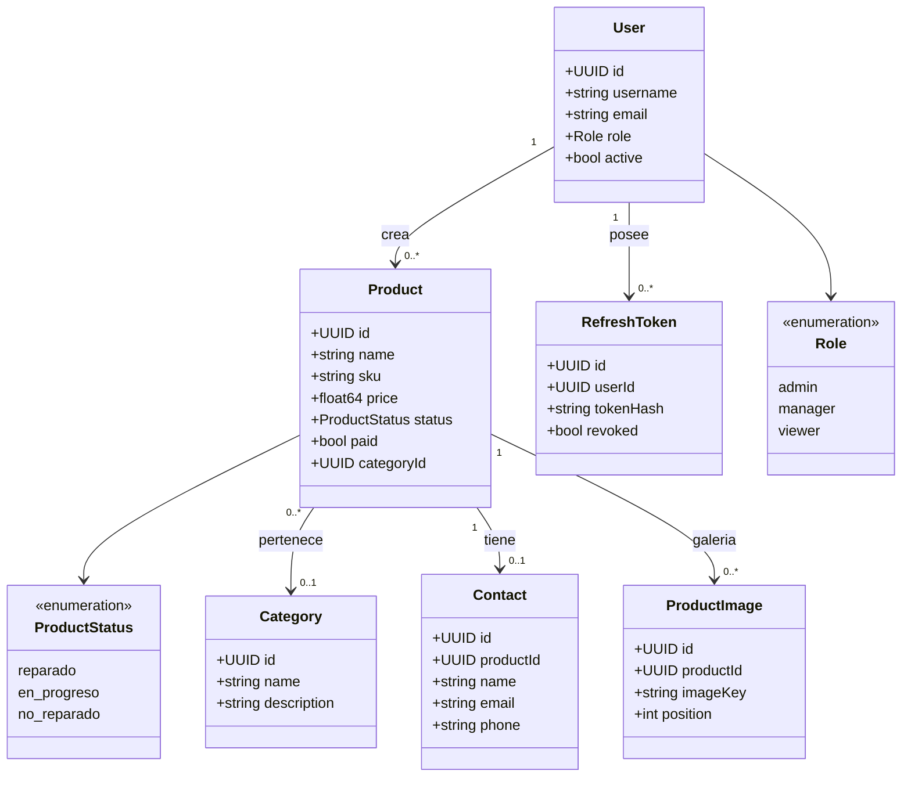
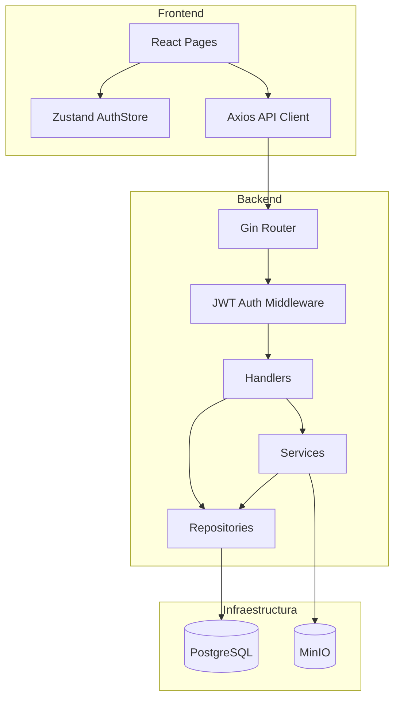
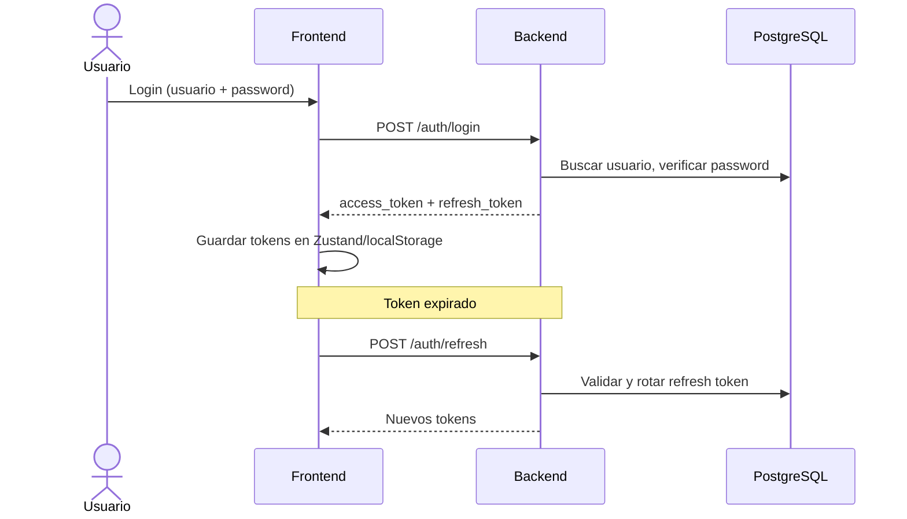
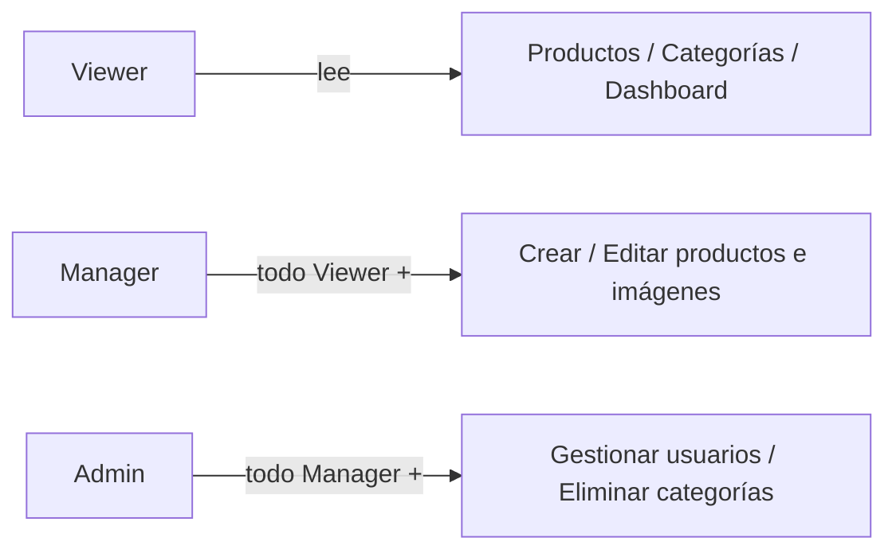

# Electroteca — Diagramas Simplificados

> Versión compacta para lectura rápida. Diagramas detallados en `DIAGRAMS.md`.

---

## 1. Entidad-Relación

---

## 2. Diagrama de Clases

---

## 3. Arquitectura — Capas del sistema

---

## 4. Flujo de autenticación

---

## 5. Roles y permisos

